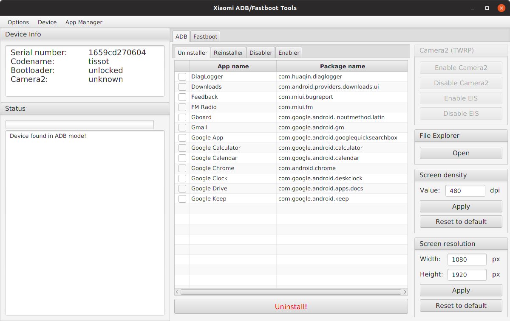

# Steps to remove MIUI Bloatware using Windows 10 or later
To protect my privacy, save space, optimize battery life and improve the user experience… I found an easy way to remove redundant system apps without root or unlocking the bootloader. This should work on MIUI version 12, 13, 14 or higher.

## Tools to be downloaded
- [Open JDK](https://adoptopenjdk.net/)
- [Universal ADB Drivers](https://xiaomifirmware.com/downloads/download-adb-installer-v1-4-3-drivers-adb-fastboot-tools/)
- [XiaomiADBFastbootTools.jar](tools/XiaomiADBFastbootTools.jar)

## Videos for extra help
- [Remove System Apps on ANY Xiaomi Smartphone in 3 EASY steps!](https://www.youtube.com/watch?v=3_rqhoMpr_Y)

## Instructions
1. Enable `USB Debugging` on the MIUI Android device in the MIUI Settings
   
3. Install these Windows tools
   - Download OpenJDK and install
   - Download Universal ADB Drivers and install
   - Save XiaomiADBFastbootTools.jar to Downloads folder
     
4. Run the `XiaomiADBFastbootTools.jar` using command line:
   > java -jar XiaomiADBFastbootTools.jar

   
### XiaomiADBFastbootTools Application

The Xiaomi ADB/Fastboot tool can be used to uninstall, reinstall, deactivate, and reactivate system apps and services on demand.

### List of Applications that can be uninstalled
**[Updated List](https://rootmygalaxy.net/xiaomi-bloatware-list-remove-safely-from-miui/)**

## FAQs (Frequently Asked Questions)

__Q. Is it Safe to Uninstall Apps from my device running MIUI?__

*A. While the answer varies depending on the application being uninstalled, most apps are safe to remove. However, programmes that offer basic functionality, such as the Dialer application, MIUI framework, and others, should not be tampered with.*

__Q. Do Uninstalled System Apps Affect OTA Updates?__

*A. No, deleting apps from your smartphone has no effect on your smartphone’s OTA software upgrades.*
